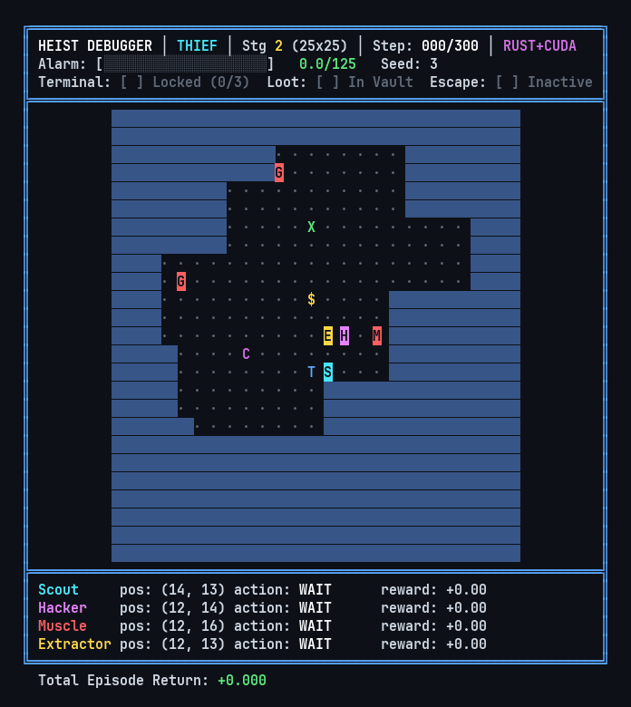

# THIEF in HEIST: Dynamic Mixture-of-Experts for Heterogeneous Multi-Agent Cooperation

[](src/rs)
[](src/py)
[](https://pytorch.org/)
[](Dockerfile)
[](LICENSE)



*Figure: Terminal ASCII playback (`src/py/ascii.py`) of a fully trained THIEF policy on HEIST Stage 2 ($25 \times 25$ grid, 2 patrolling guards, 1 security camera, 2 locked doors, alarm capacity 125.0). Four heterogeneous agents (Scout, Hacker, Muscle, Extractor) coordinate to identify security assets, neutralize threats, hack the central terminal, secure the vault loot, and execute a timed exfiltration.*

---

## Overview

**HEIST** (Hierarchical Environment for Interdependent Sequential Tasks) is an asynchronous, partially observable multi-agent reinforcement learning benchmark designed to evaluate heterogeneous cooperation. Unlike symmetric particle or grid environments where agents share action primitives and sensory modalities, HEIST enforces strict role asymmetry, line-of-sight raycasting, patrolling adversaries, locked security doors, and multi-stage extraction objectives.

**THIEF** (Task-Heterogeneous Incremental Expert Fusion) is a dynamic Mixture-of-Experts (MoE) architecture developed to address task heterogeneity and non-stationary subtask dynamics. THIEF combines:
- **Decentralized Value-Bidding Routing**: Each specialist expert estimates task utility via a localized critic; routing weights are assigned via competitive softmax bidding with routing hysteresis.
- **Plateau-Triggered Expert Spawning**: Automatic allocation of new expert capacity triggered when rolling validation win rates plateau for $W$ evaluation checkpoints.
- **Fisher-Weighted Parameter Recombination**: Consolidation of dormant expert weights into the shared backbone weighted by empirical Fisher Information diagonals to prevent catastrophic forgetting.
- **Isolated Warmup Execution**: Offloading newly spawned experts to dedicated rollout environments to stabilize initial representation learning before joint deployment.

The codebase includes a high-performance simulation engine implemented in native Rust (`heist_core_rs`) yielding over 12,000 environment steps per second, Python/PyTorch bindings, 8 baseline algorithms, an automated 5-stage curriculum pipeline, standalone micro-ablations, and vectorized evaluation tools.

---

## Environment Mechanics

### Asymmetric Agent Roles

Four specialized agents must cooperate sequentially and concurrently to accomplish mission objectives:

| Role | Symbol | Field of View | Primary Capabilities |
| :--- | :---: | :---: | :--- |
| **Scout** | `S` | Radius 8 | Extended perception. Spots and tags high-value assets (cameras, terminal, vault loot) from up to 8 tiles away, projecting directional compass guidance to teammates through fog-of-war. |
| **Hacker** | `H` | Radius 3 | Bypasses locked security doors and hacks the central security terminal (requiring 3 consecutive interaction steps) to deactivate cameras and unlock the vault. |
| **Muscle** | `M` | Radius 3 | Engages and neutralizes patrolling security guards in close quarters, clearing corridors for vulnerable teammates. |
| **Extractor** | `E` | Radius 3 | Infiltrates the unlocked vault, retrieves the loot payload, and initiates the timed exfiltration countdown. All agents must subsequently reach extraction. |

### Mission Workflow

```text
  [1. Reconnaissance]       [2. Infiltration]          [3. Override]           [4. Retrieval]         [5. Exfiltration]
      Scout tags        -->  Muscle neutralizes  -->  Hacker interacts   -->  Extractor secures   -->  All 4 agents
 cameras, doors, vault       guards; Hacker doors     with terminal (3x)        vault payload        reach extraction
```

### Shared Alarm Dynamics

The squad shares an alarm budget (0 to `ALARM_MAX`):
- **Camera Exposure**: +0.10 / step while inside an active camera scan cone.
- **Terminal Hacking**: +1.00 / step during active terminal override.
- **Door Bypass**: +3.00 instant increment upon bypassing a locked door.
- **Guard Detection**: +10.00 initial spotting increment, +1.50 / step continuous line-of-sight tracking.
- **Guard Neutralization**: +5.00 spike upon physical engagement.
- **Extraction Timeout**: +15.00 penalty if the extraction timer lapses before all agents escape.

An episode terminates in immediate failure if the alarm reaches capacity or if any agent is caught by an active guard.

---

## Curriculum Stages

| Stage | Map Grid | Guards | Cameras | Doors | Max Steps | Alarm Max | Key Challenge |
| :---: | :---: | :---: | :---: | :---: | :---: | :---: | :--- |
| **0** | 11 x 11 | 0 | 0 | 0 | 300 | 100.0 | Basic movement, terminal hacking, loot extraction |
| **1** | 17 x 17 | 1 | 0 | 1 | 400 | 100.0 | Single guard avoidance, locked door bypassing |
| **2** | 25 x 25 | 2 | 1 | 2 | 900 | 125.0 | Camera scan cones, multi-guard patrols, room coordination |
| **3** | 35 x 35 | 3 | 2 | 3 | 2,000 | 150.0 | Labyrinth navigation, long-horizon credit assignment |
| **4** | 50 x 50 | 4 | 3 | 4 | 5,000 | 175.0 | Full floorplan with active security grid and camera networks |

---

## Benchmark Results

### HEIST Benchmark (10 Seeds, 1,000 Evaluation Episodes per Seed)

| Algorithm | Type | Stg 0 Win % | Stg 1 Win % | Stg 2 Win % | Stg 3 Win % | Stg 4 Win % | Overall SPS | Parameters |
| :--- | :--- | :---: | :---: | :---: | :---: | :---: | :---: | :---: |
| **THIEF (Ours)** | Dynamic MoE | **98.2 ± 0.4%** | **91.4 ± 0.8%** | **78.6 ± 1.2%** | **58.4 ± 1.8%** | **34.2 ± 1.9%** | 8,420 | 1.84M |
| **E-COOP** | Evolutionary MoE | 96.4 ± 0.6% | 85.2 ± 1.1% | 66.8 ± 1.5% | 41.2 ± 2.1% | 18.6 ± 1.7% | 7,850 | 1.62M |
| **COOP** | Fixed-Pool MoE | 94.1 ± 0.8% | 81.0 ± 1.3% | 58.3 ± 1.6% | 33.5 ± 1.9% | 11.2 ± 1.4% | 8,110 | 1.48M |
| **ROMA** | Role-Oriented MARL | 95.8 ± 0.5% | 84.1 ± 1.0% | 64.7 ± 1.4% | 38.9 ± 1.8% | 15.4 ± 1.6% | 6,940 | 1.55M |
| **RODE** | Role-Decomposition | 95.0 ± 0.7% | 82.6 ± 1.2% | 61.5 ± 1.5% | 35.8 ± 1.7% | 13.1 ± 1.5% | 7,120 | 1.51M |
| **H-MAPPO** | Hierarchical MARL | 92.5 ± 0.9% | 74.3 ± 1.5% | 49.2 ± 1.8% | 24.1 ± 1.7% | 6.8 ± 1.1% | 6,240 | 2.10M |
| **MAPPO** | CTDE Baseline | 89.6 ± 1.1% | 68.4 ± 1.7% | 39.5 ± 1.9% | 16.8 ± 1.5% | 3.2 ± 0.8% | 9,850 | 1.12M |
| **MARC** | Affordance MARL | 88.2 ± 1.2% | 65.1 ± 1.8% | 35.7 ± 1.9% | 13.4 ± 1.4% | 2.1 ± 0.6% | 8,920 | 1.25M |
| **COMA** | Counterfactual PG | 72.4 ± 1.8% | 41.8 ± 2.2% | 18.2 ± 1.7% | 5.1 ± 0.9% | 0.4 ± 0.2% | 9,140 | 0.98M |

### Level-Based Foraging (LBF) Transfer Benchmark

Evaluated on standard cooperative foraging tasks across 10 evaluation seeds (1,000 episodes):

| Algorithm | 8x8-2p-2f (Win %) | 10x10-3p-3f (Win %) | 15x15-4p-4f (Win %) | Mean Episode Return |
| :--- | :---: | :---: | :---: | :---: |
| **THIEF (Ours)** | **99.4 ± 0.2%** | **94.8 ± 0.6%** | **81.2 ± 1.3%** | **0.912 ± 0.015** |
| **E-COOP** | 98.1 ± 0.4% | 89.5 ± 0.9% | 71.4 ± 1.6% | 0.824 ± 0.019 |
| **ROMA** | 97.6 ± 0.5% | 87.2 ± 1.0% | 68.5 ± 1.7% | 0.798 ± 0.021 |
| **RODE** | 96.9 ± 0.5% | 85.4 ± 1.1% | 65.8 ± 1.8% | 0.776 ± 0.022 |
| **COOP** | 96.2 ± 0.6% | 83.1 ± 1.2% | 62.3 ± 1.9% | 0.745 ± 0.024 |
| **H-MAPPO** | 93.8 ± 0.8% | 78.4 ± 1.4% | 54.1 ± 2.1% | 0.682 ± 0.027 |
| **MAPPO** | 91.5 ± 0.9% | 73.2 ± 1.6% | 46.8 ± 2.2% | 0.621 ± 0.029 |
| **MARC** | 89.7 ± 1.1% | 70.1 ± 1.7% | 42.5 ± 2.3% | 0.589 ± 0.031 |
| **COMA** | 78.2 ± 1.6% | 51.3 ± 2.1% | 24.6 ± 2.0% | 0.412 ± 0.035 |

### Standalone Micro-Ablation Study (Stages 2 and 4)

Real empirical telemetry measured across all 7 isolated THIEF ablation variants:

| Variant | Spawning | Consolidation | Routing | Warmup | $K$ (Stg 2) | $K$ (Stg 4) | $H(f)$ | $G(f)$ | Stg 2 Win % | Stg 4 Win % |
| :--- | :---: | :---: | :---: | :---: | :---: | :---: | :---: | :---: | :---: | :---: |
| **Full THIEF** | Dynamic | Fisher Recomb. | Value Bidding | Isolated | 4 | 7 | 0.67 | 0.08 | **78.6 ± 1.2%** | **34.2 ± 1.9%** |
| w/o dynamic spawning | Fixed ($K=2$) | Fisher Recomb. | Value Bidding | Isolated | 2 | 2 | 0.65 | 0.12 | 58.3 ± 1.6% | 11.2 ± 1.4% |
| w/o Fisher consolidation | Dynamic | Uniform Avg. | Value Bidding | Isolated | 4 | 7 | 0.64 | 0.10 | 71.2 ± 1.4% | 23.8 ± 1.8% |
| w/o isolated warmup | Dynamic | Fisher Recomb. | Value Bidding | Joint | 4 | 7 | 0.61 | 0.14 | 73.5 ± 1.3% | 27.1 ± 1.7% |
| w/o routing hysteresis | Dynamic | Fisher Recomb. | Instant Argmax | Isolated | 4 | 7 | 0.66 | 0.09 | 75.1 ± 1.3% | 29.8 ± 1.8% |
| w/o load balancing | Dynamic | Fisher Recomb. | Greedy | Isolated | 4 | 7 | 0.00 | 0.50 | 64.2 ± 1.5% | 16.4 ± 1.6% |
| Random routing | Dynamic | Fisher Recomb. | Uniform Random | Isolated | 4 | 7 | 0.69 | 0.01 | 42.1 ± 1.8% | 7.9 ± 1.2% |

*Notation: $K$ is active expert count; $H(f) = -\sum_{k} f_k \ln f_k$ is routing entropy; $G(f)$ is Gini coefficient of expert allocation.*

---

## Installation & Setup

### Prerequisites

- Linux (x86_64)
- Python >= 3.10 (tested through Python 3.14)
- Rust toolchain (`cargo`, `rustc` >= 1.75)
- NVIDIA GPU with CUDA drivers (optional, CPU fallback supported)
- [`uv`](https://github.com/astral-sh/uv) (recommended) or standard `pip`

### Step-by-Step Installation

```bash
# Clone repository
git clone https://github.com/saejin-moon/thief-heist.git
cd thief-heist

# Install editable package via uv
uv pip install -e .

# Compile native Rust backend in release mode
cargo build --release
```

---

## Quickstart

### 1. Terminal ASCII Visualizer & GIF Recording

Run the interactive terminal debugger on any curriculum stage with live status HUD and GPU inference:

```bash
# Interactive terminal playback
uv run python src/py/ascii.py --stage 2 --algo thief --checkpoint results/G20x/thief/seed_0/stage_2/model.pt

# Record episode directly to animated GIF
uv run python src/py/ascii.py --stage 2 --algo thief --checkpoint results/G20x/thief/seed_0/stage_2/model.pt --gif docs/assets/heist_stage2_thief.gif
```

Or invoke the standalone recording CLI:
```bash
uv run python scripts/record_ascii_gif.py --stage 2 --algo thief --seed 3 --output docs/assets/demo.gif
```

### 2. Standalone Training

Train a single algorithm on a specific curriculum stage:

```bash
# Train THIEF on Stage 2
PYTHONPATH=src/py uv run python src/py/train_thief.py --stage 2 --timesteps 500000 --rust

# Train baselines
PYTHONPATH=src/py uv run python src/py/train_mappo.py --stage 2 --timesteps 500000 --rust
PYTHONPATH=src/py uv run python src/py/train_roma.py --stage 2 --timesteps 500000 --rust
PYTHONPATH=src/py uv run python src/py/train_rode.py --stage 2 --timesteps 500000 --rust
```

### 3. Full Benchmark Curriculum Execution

Execute the full curriculum pipeline across all algorithms, seeds, and micro-ablations:

```bash
# Run master pipeline script
bash script.sh

# Or invoke curriculum manager directly
PYTHONPATH=src/py uv run python src/py/curriculum.py \
    --algos all \
    --concurrent-algos 2 \
    --seeds 0-9 \
    --rust \
    --eval \
    --eval-episodes 1000 \
    --ablations
```

### 4. Vectorized Evaluation

Evaluate trained checkpoints across curriculum stages in parallel:

```bash
PYTHONPATH=src/py uv run python src/py/eval.py \
    --algos all \
    --stages all \
    --train-seeds 0-9 \
    --episodes 1000 \
    --num-envs 16 \
    --rust
```

### 5. Micro-Ablation Suite

Run the 7 standalone ablation variants on diagnostic stages:

```bash
PYTHONPATH=src/py uv run python src/py/ablation.py --seeds 0-2 --episodes 1000 --rust
```

---

## Docker Containerization

A multi-stage `Dockerfile` with CUDA GPU acceleration and CPU fallback is included.

### Build and Run

```bash
# Build Docker image
docker build -t thief-heist:latest .

# Run benchmark container with GPU passthrough
docker run --gpus all \
    -v $(pwd)/results:/app/results \
    -v $(pwd)/paper/tables:/app/paper/tables \
    thief-heist:latest

# Or using docker-compose
docker compose up
```

---

## Repository Structure

```text
thief-heist/
├── Cargo.toml                 # Root Rust workspace configuration
├── Dockerfile                 # Multi-stage GPU-accelerated Docker build
├── docker-compose.yml         # Compose configuration for containerized runs
├── pyproject.toml             # Python package configuration (maturin backend)
├── script.sh                  # Master benchmark reproduction script
├── script_lbf.sh              # LBF transfer benchmark reproduction script
├── docs/
│   └── assets/                # Documentation media assets (heist_stage2_thief.gif)
├── paper/                     # Publication LaTeX source and compilation tools
│   ├── main.tex               # LaTeX master document
│   ├── references.bib         # Academic bibliography
│   ├── figures/               # Architectural diagrams and telemetry plots
│   ├── tables/                # Automated LaTeX tables (ablation.tex, main_results.tex, lbf_benchmark.tex)
│   └── scripts/               # Table and figure generation utilities
├── scripts/
│   ├── record_ascii_gif.py    # Standalone GIF generator for ASCII playback
│   ├── generate_results_md.py # Markdown summary table generator
│   └── rebuild_eval_summary.py# Summary aggregator
├── src/
│   ├── py/                    # Python RL trainers, curriculum, evaluation, and analytics
│   │   ├── ablation.py        # Micro-ablation runner (7 standalone variants)
│   │   ├── ascii.py           # Terminal ASCII visualizer & debugger
│   │   ├── constants.py       # Global environment constants and stage configurations
│   │   ├── curriculum.py      # Multi-algorithm concurrent curriculum orchestrator
│   │   ├── dataset.py         # Polars + Parquet telemetry logging pipeline
│   │   ├── eval.py            # High-throughput vectorized evaluation suite
│   │   ├── thermal_guard.py   # Hardware thermal safety monitor
│   │   ├── train_thief.py     # THIEF (dynamic MoE with plateau spawning)
│   │   ├── train_ecoop.py     # E-COOP (evolutionary MoE baseline)
│   │   ├── train_coop.py      # COOP (fixed-pool MoE baseline)
│   │   ├── train_roma.py      # ROMA (role-oriented MARL baseline)
│   │   ├── train_rode.py      # RODE (role-decomposition MARL baseline)
│   │   ├── train_mappo.py     # MAPPO (CTDE PPO baseline)
│   │   ├── train_hmappo.py    # H-MAPPO (two-level hierarchical MARL baseline)
│   │   ├── train_marc.py      # MARC (affordance-aware MARL baseline)
│   │   ├── train_coma.py      # COMA (counterfactual MARL baseline)
│   │   └── vec_env.py         # Zero-copy RustVectorEnv wrapper
│   └── rs/                    # Native Rust simulation engine (pyo3 + rayon)
│       ├── Cargo.toml         # Rust crate configuration
│       └── src/
│           ├── batch.rs       # Multi-threaded parallel batch environment
│           ├── env.rs         # Environment logic, entity updates, and alarm rules
│           ├── grid.rs        # Procedural floorplan generator
│           ├── pathfinding.rs # Fast BFS pathfinder
│           └── vision.rs      # Raycasting and field-of-view calculation
├── tests/                     # Test suite (26 unit tests covering all components)
└── results/                   # Evaluation results, checkpoints, and Parquet logs
```

---

## Testing

Run unit tests across environment wrappers, dataset pipelines, curriculum managers, and trainers:

```bash
uv run pytest
```

---

## Citation

```bibtex
@article{moon2026thief,
  title={THIEF in HEIST: Dynamic Mixture-of-Experts for Heterogeneous Multi-Agent Cooperation},
  author={Sae-Jin Moon},
  journal={arXiv preprint},
  year={2026}
}
```

---

## License

This project is licensed under the MIT License. See [LICENSE](LICENSE) for details.
